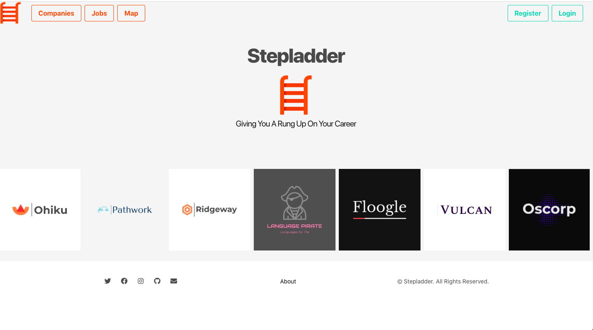
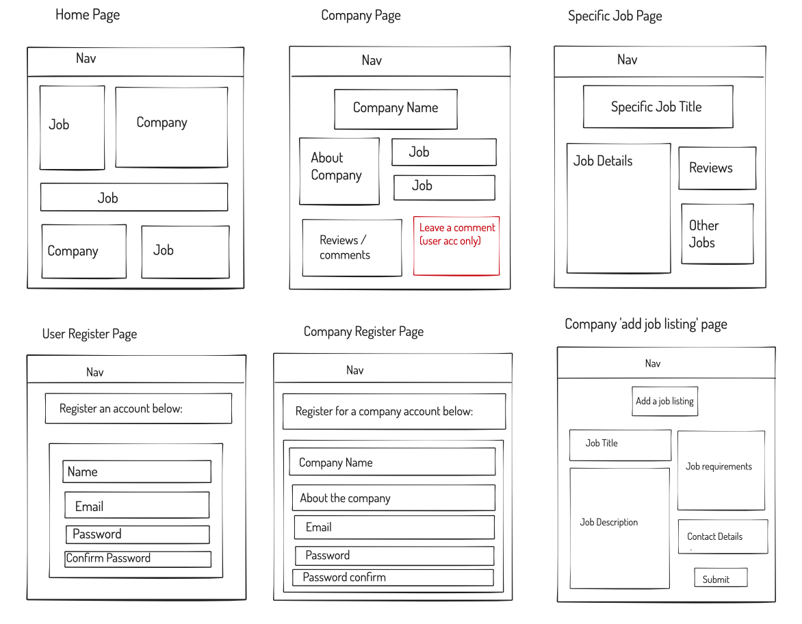
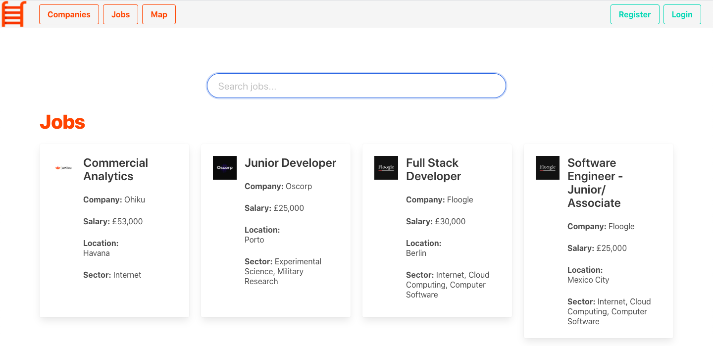
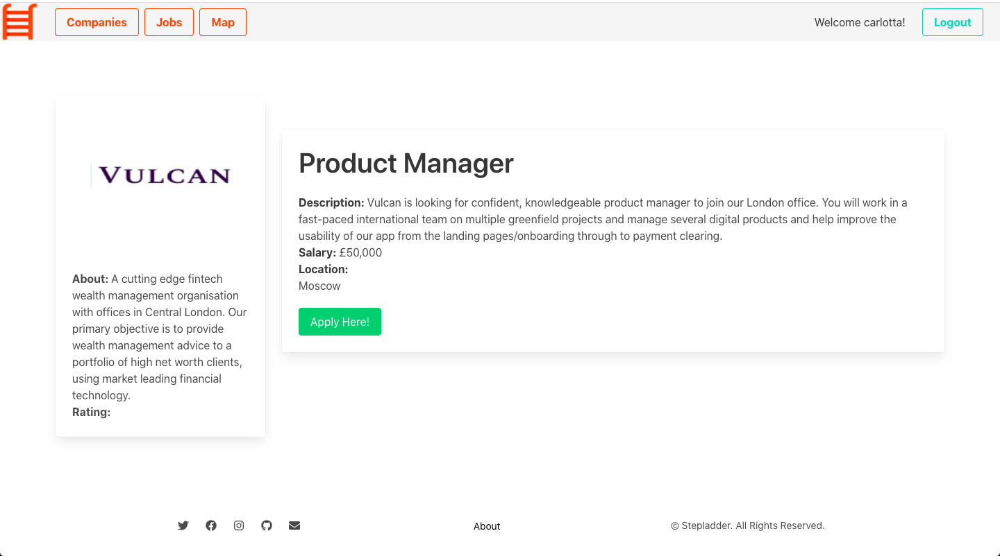
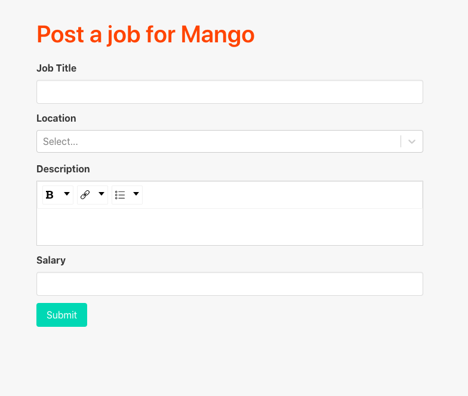
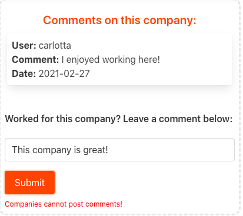
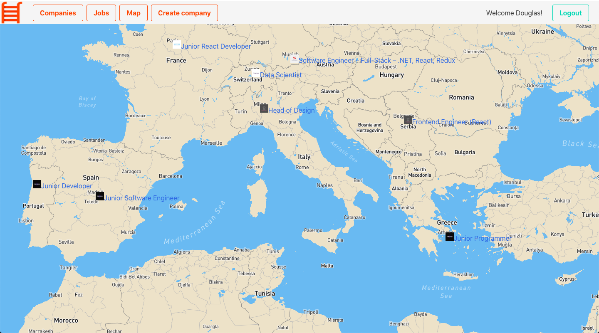
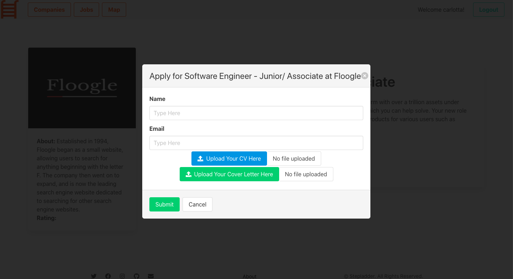
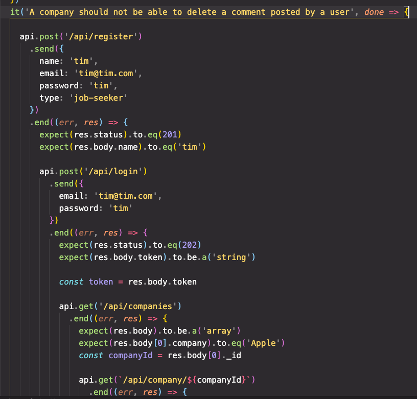

## General Assembly Project 3 

# **Stepladder**

<b>The Developers:</b>

Clement Knox, Vesna Zivanovic, Tom Briody, and Lydia Wood

<b>Timeframe:</b>

1 week

<b>The Goal:</b>

To build a full-stack app our choice from scratch using a MERN (Mongoose, Express, React, Node) stack and then deploy it using Heroku. 

Technologies Used:

<b>Front-end:</b>
<ul>
<li>HTML5</li>
<li>JavaScript (ES6)</li>
<li>SASS</li>
<li>Bulma</li>
<li>React</li>
<li>React-Router</li>
<li>Webpack</li>
</ul>
<b>back-end:</b>
<ul>
<li>Node.js</li>
<li>Express</li>
<li>Mongoose</li>
<li>MongoDB</li>
</ul>
<b>Testing</b>
<ul>
<li>Chai</li>
<li>Mocha</li>
<li>Supertest</li>
</ul>
<b>External Libraries</b>
<ul>
<li>Axios</li>
<li>Mapbox</li>
<li>draft.js</li>
<li>draftToHTML</li>
</ul>
<b>Other</b>
<ul>
<li>Github</li>
<li>Git</li>
<li>Heroku</li>
<li>Mongo Atlas</li>
</ul>


<b>The App:</b>

*Stepladder* is a clone of popular jobs websites like Glassdoor. On the front-end, the user can sign up as a job-seeker, browse companies and jobs, post comments on company pages, and apply for roles. Alternatively, recruiters can sign-in and post jobs to companies that already exist or register a new company and post jobs to that. Depending on whether the user is a job-seeker or a company recruiter they will be able to do and see different things on the website. The front-end was built using React and Bulma. Behind the scenes the Stepladder webpage is powered by a CRUD API we built from scratch using Mongoose, MongoDB, Node.js and Express. The various user stories permitted on the front-end are made possible by the MVC-structured API on the back-end. The functionality of the website was verified by writing and running a full-suite of tests written with Chai, Mocha, and Supertest. 

<b>Use the deployed version here:</b>

<a href='https://stepladder2021.herokuapp.com/
'>https://stepladder2021.herokuapp.com/</a>

(Make sure to register and sign-in as a job-seeker and then a company admin to see the full-range of permissions!)

<br>




## Building *Stepladder*

### _The Process_


The basic idea of building a clone of Glassdoor was made jointly and quickly. The aim of this project was to showcase our recently-acquired knowledge of back-end programming and demonstrate how API requests could be used to communicate between our database and our front-end interface. A jobs site with different accounts and permissions for different types of users and a database of companies and jobs was the perfect vehicle for test-driving these new skills.

We spent the first day brain-storming and whiteboarding out ideas for how the website would be structured on the front-end and the back-end.



<i>An early blueprint for our front-end.</i>
<br><br>
Then we began thinking about how we would structure the development of the project. We decided to do the back-end jointly, by pair-programming. We did this because we knew version control would be a big issue and it was important that we started out knowing that our back-ends were all structured the same way so as to avoid facing problems further down the line. This was actually pretty painless -- it was all done within a day, leaving five full days to work on the front-end.
We were keen to make sure that everyone did everything to avoid the siloing of skills and knowledge. At the same time, it made sense to split the work initially to get the skeleton of the website up and running. This meant that everyone took ownership of certain parts of the code--Vesna built the company registration page, Lydia built the job posting page, Tom built the navbar, and Clement did the jobs page--but then we all spent time revising, debugging, and restyling all the different parts of the website. Finally, we set aside a full day at the end of the project for building tests. To help streamline the development process we agreed at the beginning to use Bulma to build the various components. This helped standardize the look of the app and made it easier for us to read and tinker with each other's code.

How did it go? 

Brilliantly! We worked well as a team and once we scored some early wins--like building the back-end so quickly--our nerves settled and we got into a good routine. Version control was a major source of anxiety but after a while we developed muscle memory for the Git commands. Communication was key here. We made abundant use of Slack and Zoom to ensure everyone knew what everyone else was working on and when they were doing pushes and pulls from the development branch.

## The Code

### _The Back-End

Our back-end was built using Mongoose, MongoDB, Node.js, and Express. Essentially, we built our CRUD API using a Model-View-Controller (MVC) pattern to structure the endpoints. At a very high level there were two basic data collections: users and companies. We had a model for a user and a model for a company, and then views and controllers for each kind.

<i>Our user model</i>

```
	const schema = new mongoose.Schema({
	  name: { type: String, required: true },
	  email: { type: String, required: true, unique: true },
	  password: { type: String, required: true },
	  type: { type: String, required: true },
	  isAdmin: { type: Boolean }
	})	 
```
The models had their own idiosyncrasies. Security concerns were paramount for the user model. We used bcrypt, mongoose-hidden, and mongoose unique validator to provide basic data protections for user information. The company model was larger and more complicated, in large part because the information for individual jobs 'lived' on the company object, so did user comments. This made for some interesting challenges later on. MongoDB created unique id numbers for all the data points--companies, jobs, users, comments--that populated our back-end. This meant we could fetch a company or a job using its id number. But if we fetched a job we might also want some information about the company that posted the job as well--but these data points were parcelled out. We had to do some pretty ingenious coding to get around the challenges this sometimes threw up!

<i>Our company model -- note that the comments and jobs live on the larger company object.</i>


```
const companySchema = new mongoose.Schema({
  company: { type: String, required: true, unique: true },
  website: { type: String, required: true },
  about: { type: String, required: true },
  industry: { type: [String], required: true },
  logo: { type: String, required: true },
  jobs: [jobSchema],
  user: { type: mongoose.Schema.ObjectId, ref: 'User', required: true },
  ratings: [ratingSchema],
  comments: [commentSchema]
})  
```
Making the views and controllers was pretty easy. We made routes for users to register, login, leave comments, post jobs, and delete things they had posted and coded out controllers that allowed them to do all those things. That having been said, this part of the code base was also a work-in-progress as we did add more routes and controllers as the project went on, where as we kept the models as they were to ensure consistency on the back-end. (One small exception to this was the 'location' key on the job scheme which we had to adjust so we could use React Select on the front-end.)

<i>An example of some routes...</i>

```
router.route('/login/:userId')
  .get(user.getSingleUser)

router.route('/company/:companyId/comment')
  .post(secureRoute, comment.makeComment)
```
  
<i>and a controller...</i>


```
async function makeComment(req, res, next) {
  const commentData = req.body
  const companyId = req.params.companyId
  commentData.user = req.currentUser
  const currentUser = req.currentUser
  try {
    const company = await Company.findById(companyId).populate('comments.user').populate('user')
    if (!company) {
      console.log('COMPANY', company)
      return res.status(404).send({ message: 'Not found' })
    }
    if (currentUser.type === 'company-admin') {
      return res.status(401).send({ message: 'Unauthorized' })
    }
    company.comments.push(commentData)
    const savedCompany = await company.save()
    res.status(201).send(savedCompany)
  } catch (err) {
    next(err)
  }
}
```

### _The Front-End

<b>Structure</b>


Our front-end was structured in our App.js file using React Router which created a number of pathways to pages which we then stitched together using links.

<i>Our app.js file:</i>

```
	const App = () => (
  		<BrowserRouter>
    		<Navbar />
    		<Switch>
      			<Route exact path="/" component={Home} />
     			 <Route exact path="/register" component={Register} />
     			 <Route exact path="/login" component={Login} />
     			 <Route exact path="/companies" component={Companies} />
     			 <Route exact path="/jobs" component={Jobs} />
     			 <Route exact path="/company/create" component={CreateCompany} />
     			 <Route exact path="/company/:companyId" component={Company} />
     			 <Route exact path="/job/:jobId" component={Job} />
     			 <Route exact path="/company/:companyId/job" component={PostJob} />
     			 <Route exact path="/jobs" component={Jobs} />
    			 <Route exact path="/map" component={Map} />
     			 <Route exact path="/about" component={About} />
    		</Switch>
    		<Footer />
  	</BrowserRouter>
	) 
```

Having all the components and all the paths visible on one page really helped in terms of structuring the front-end and dividing the workload between the four of us. When it came to building invididual pages, the paths--which corresponded to views on the back-end--helped make sense of what the user was going to click through to. 
For instance, this was the jobs component at ```<Route exact path="/jobs" component={Jobs} /> ```<br>



which led to the individual job component at 
```<Route exact path="/job/:jobId" component={Job} />```
<br>



The intention was that everything should connect to everthing else. We wanted as few dead-ends as possible. Almost every logo is also a link. We wanted the user to be able to navigate the site intuitively.

**Forms**

Some of the most complex pieces of code involved forms where the user could login, register, post a job, or post a comment. Here the front-end was speaking to the back-end to post, put, and delete data-points hosted on our database. We also had to use some external libraries to make our forms look professional. On the page where a company admin could post a job, we used React Draft and draft.js to build a beautiful, true-to-life form:



This created other challenges as we then had to convert this entered content into usable HTML. We used an external library named draftToHTML to do this!  

<i>draftToHTML in action:</i>

```
  const [editorState, setEditorState] = useState(EditorState.createEmpty())
  const rawContentState = convertToRaw(editorState.getCurrentContent())
  const markup = draftToHtml(
    rawContentState
  )
```

<b>Authentications and Permissions</b>

Probably the most important part of making our website look and feel true to life was the use of permissions and authentications so that the website would treat different kinds of users differently.

There are four types of users:
1. Unregistered browsers
2. Registered job-seekers
3. Registered company admins
4. The moderator

All four groups could see and do slightly different things. For instance, a company admin could never post or delete a comment. Neither could a unregistered browser. A registered job-seeker could post comments but could only delete comments they had written. The moderator could delete anyone's comments but could not post one. 

How did we do all this?

At the heart of it was some logic on the login page. Here we used local storage so that when a user logged in a token generated on the back-end would be passed through and saved in local storage. The token would be used to extract the user id and this would be used to fetch the user information from the back-end and then save the 'type' of user--job-seeker, admin, or moderator--in local storage, too. This information would then 'follow' the user around as they travelled through the site. When they logged out the local storage would be emptied and the token would be discarded. 

<i>The code on the login where the token would be recorded in local and storage, along with the type of user logged in:</i>


```
if (localStorage) {
        localStorage.setItem('token', data.token)
        const token = data.token
        const payloadAsString = atob(token.split('.')[1])
        const payloadAsObject = JSON.parse(payloadAsString)
        const userID = payloadAsObject.userId
        const filtered = userList.filter((user) => {
          if (user._id === userID) {
            return user
          }
        })
        const isMod = userList.filter((user) => {
          if (user.type === 'mod') {
            return user
          }
        })
        if (isMod[0] === filtered[0]) {
          localStorage.setItem('mod', 'true')
        } else localStorage.setItem('mod', 'false')
        localStorage.setItem('name', filtered[0].name)
        localStorage.setItem('type', filtered[0].type)
      }
      history.push('/')
```

Finally, there was a piece of code held in auth.js that we used in a number of places to determine quickly if the current user was also the user that had, for instance, posted a specific comment. This also made use of local storage and the token:

```
export function getLoggedInUserId() {
  if (!localStorage) return false
  const token = localStorage.getItem('token')
  if (!token) return false
  const payloadAsString = atob(token.split('.')[1])
  const payloadAsObject = JSON.parse(payloadAsString)
  return payloadAsObject.userId
}
export function isCreator(userIdToCompare) {
  if (!userIdToCompare) return false
  return userIdToCompare === getLoggedInUserId()
}
```

Now on the company page this information would be used to manage who could delete a comment.

Here's the code for deleting a comment:
<br>

```
 function handleDeleteComment(commentId) {
    axios.delete(`/api/company/${id}/comment/${commentId}`, {
      headers: { Authorization: `Bearer ${token}` }
    })
      .then(resp => {
        updateCompany(resp.data)
      })
  }
```

<br>
And it would also be used to determine what kind of elements would appear on the page. For instance, the option to delete a commment would only appear if the user was the same user that generated the comment OR if the user was the moderator. 
<br>

```
{(isCreator(comment.user._id) || localStorage.getItem('mod') === 'true') && <div className="media-right">
                <button
                  className="delete"
                  onClick={() => handleDeleteComment(comment._id)}>
                </button>
              </div>}
```

These permissions tests had UI consequences. If a company admin tried to post a comment on their own company page the following error message would appear:



<b>Other features</b>


* The carousel on the home page was built using a Slider from <a href='https://www.npmjs.com/package/react-slick'>React Slick</a> and was populated with company logos pulled from the back-end. We thought it looked pretty cool! <br>
* We had search bars on the jobs page and the companies page so the user could easily search for jobs by sector or companies by name. We were very pleased with how sleek it looked! <br>
* We had a map feature where all the jobs posted were displayed on a map of the world generated using <a href='https://www.mapbox.com/'>MapBox</a> and Geocodes generated by <a href='https://opencagedata.com/'>OpenCage</a>. All the jobs on the map were links which took the user through to the individual job page.  <br>
 <br>
* If users clicked on the apply button on the job page they would be taken to this modal where they could upload a CV and cover letter! <br>

<br>
<br>

<b>Styling</b>


We made the decision to use Bulma which brought its ups and downs. It made it easier to standardize the look of the website whilst making the layout of each page  slightly harder to engineer. Bulma also bulked out our code...

*A very long piece of Bulma code*

```
<Link to={{ pathname: `/job/${job._id}`, state: { companyID: job.companyID } }}>
              <div className='card'>
                <div className='card-content job-cards grow'>
                  <div className='media'>
                    <div className='media-left'>
                      <figure className='image is-48x48'>
                        
                      </figure>
                    </div>
                    <div className='media-content '>
                      <p className='title is-4'>{job.title}</p>
                      <ul>
                        <li className='subtitle is-6'><b>Company:</b> {job.company}</li>
                        <li className='subtitle is-6'><b>Salary:</b> {job.salary}</li>
                        <li className='subtitle is-6'><b>Location:</b> {job.location.map((local, index) => {
                          return <div key={index}>{local}</div>
                        })}</li>
                        <li className='subtitle is-6'><b>Sector:</b> {upperSector}</li>
                      </ul>
                    </div>
                  </div>
                </div>
              </div>
            </Link>
```  

But the benefits outweighed the drawbacks. We used custom Bulma to add our own stylings and make the page feel more personalized. For instance, we created a custom orange colour (*$danger: #FD5721*) picked out from our ladder logo using a really handy website called <a href='https://html-color-codes.info/colors-from-image/'>HTML Color Codes</a>.

Using Bulma we were also able to make our website fully responsive which we were really pleased with! 


### _The Tests_

To be as professional as possible we wanted to include a suite of tests to ensure the various end points in our website worked. These were built using Chai, Mocha, and Supertest.

The tests themselves became pretty lengthy as we looked to ensure that all the various user stories worked... 

<i>A snippet of a very lengthy test:</i>




...but it was satisfying when they did and ultimately added to the verisimilitude of the project overall.

Ultimately we had a suite of ten tests. Building them was a fantastic learning experience, especially when it came to testing permissions. It was interesting to note the difference between testing for something positive--a company admin *could* post a job for instance--versus testing something negative--like testing to ensure that a company admin *couldn't* delete a comment. 


### _Conclusion_


<b><p>Wins</p></b>

* We wanted to build a full-stack, fully-tested app with a CRUD API built from scratch and a clean, responsive front-end -- and we did!
* The team worked really well together. We communicated well throughout and debugged each other's code when we ran into problems, which we all did at various times! We were able to divide up the work in way which made sense but gave everyone exposure to every part of the code base.
* We were really pleased with how the UI interacted with the permissions we had coded in the back-end. The website was really responding to who was using it, throwing up different kinds of error messages, displaying different buttons, and sculpting the UI depending on who was logged in. 

<b><p>Challenges</p></b>

* Managing version control using Git was the source of a lot of heart-break in the early stages of the project. However, version control became more and more natural as the project went on, which helped a great deal.
* We did rely on local storage a lot which might create some compatibility problems if users were trying to use our website on older browsers.
* Getting the look of the website to conform across all the various pages was pain-staking but ultimately worthwhile work!

<b><p>What We Could Add</p></b>

* If we had more time we would have fleshed out the job application process so that email confirmations would have been sent when a job-seeker clicked 'Submit' on the job application page.
* We ran out of time before we could add to the user profile. It would be nice to make that more in-depth by adding profile photos and about me sections.


